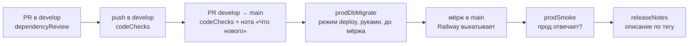
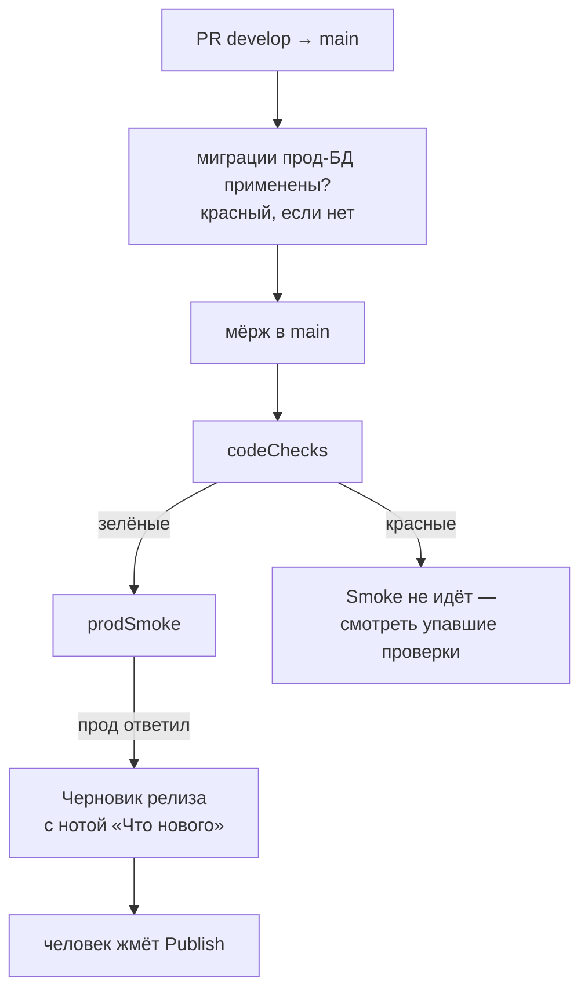

# Actions StudentHub

Восемь прогонов: пять запускаются сами, три — руками. Имена — camelCase, по области:
`code*` — проверки кода, `prod*` — всё, что трогает прод, `release*` — выпуск. Список в
боковой панели Actions отсортирован по алфавиту, поэтому группы складываются сами. У каждого в начале файла блок
«СХЕМА ПРОГОНА», а у большинства та же схема попадает в сводку запуска (вкладка **Summary**
открытого прогона) — читать YAML, чтобы понять, что происходит, не нужно.

| Прогон             | Файл                    | Когда запускается                                         | Что делает                                                                                                                                                                   |
| ------------------ | ----------------------- | --------------------------------------------------------- | ---------------------------------------------------------------------------------------------------------------------------------------------------------------------------- |
| `codeChecks`       | `ci.yml`                | push в `develop` и `main`, PR в `main`, ночью в 21:47 UTC | линт, типы, тесты, сборка, образы (только изменённые: сборка + trivy + запуск), аудит зависимостей и секретов, линт самих прогонов, контракт API, покрытие и размеры бандлов |
| `codeqlScan`       | `codeql.yml`            | push в `develop` и `main`, PR в `main`, еженедельно       | статический анализ кода и workflow; находки — во вкладке Security                                                                                                            |
| `dependencyReview` | `dependency-review.yml` | PR в `develop` и `main`                                   | что за зависимости приносит этот PR и нет ли у них уязвимостей                                                                                                               |
| `prodSmoke`        | `smoke.yml`             | push в `main` (то есть после выкатки) и руками            | стучится в прод: `/api/v1/health` и главная страница веба                                                                                                                    |
| `prodDbMigrate`    | `migrate.yml`           | руками                                                    | миграции прод-БД: сначала `status` и SQL глазами, потом `deploy`                                                                                                             |
| `prodDbSeed`       | `seed.yml`              | руками                                                    | доливает данные в прод-БД под меткой; той же меткой убирает налитое                                                                                                          |
| `prodDbReset`      | `reset-db.yml`          | руками                                                    | очищает прод-БД до одного администратора. Необратимо                                                                                                                         |
| `releaseNotes`     | `release.yml`           | публикация релиза в GitHub                                | проверяет ноту «Что нового» и заполняет описание релиза                                                                                                                      |

## Путь изменения до прода



Миграции применяются **до** мёржа в `main`: Railway деплоит по push в `main`, и новый код
не должен встретить старую схему. Отката у `prisma migrate` нет — порядок в `docs/RELEASE.md`.

## Три проверки безопасности и чем они отличаются

Они легко путаются, потому что все три про уязвимости, но смотрят в разные места:

| Где                         | Что именно смотрит                                            | Блокирует                                   |
| --------------------------- | ------------------------------------------------------------- | ------------------------------------------- |
| `ci.yml` → **Безопасность** | `package.json` всего репозитория: что у нас стоит сейчас      | да, если уязвимость в рантайм-зависимости   |
| `ci.yml` → **Образ · app**  | базовый образ и всё, что внутри собранного контейнера         | пока нет — сначала обновляем базовые образы |
| `dependency-review.yml`     | разницу между веткой PR и целевой: что приносит это изменение | да, рантайм, уровень high и выше            |

Плюс `codeql.yml` — он не про зависимости вовсе, а про собственный код: куда доходит
значение из запроса и не оказывается ли оно в SQL, пути или редиректе.

## Что с чем связано

Раньше порядок держался на человеке: не забыть накатить миграции до мёржа, не забыть
посмотреть, поднялся ли прод, не забыть создать релиз. Теперь это проверки и триггеры.



Три связки и что каждая закрывает:

| Связка           | Что было                                                                | Что стало                                                    |
| ---------------- | ----------------------------------------------------------------------- | ------------------------------------------------------------ |
| Миграции → мёрж  | правило в `docs/RELEASE.md` и в голове                                  | PR в `main` красный, пока миграции не накатаны на прод       |
| Проверки → Smoke | Smoke шёл по push в `main` и опрашивал прод даже после красного прогона | идёт только после зелёных проверок                           |
| Smoke → релиз    | релиз начинался с того, что человек вспомнил                            | черновик с описанием появляется сам, остаётся нажать Publish |

Единственное, что осталось делать руками до мёржа, — запустить `prodDbMigrate`
в режиме `deploy`. Это намеренно: операция необратимая, и автоматизировать её нельзя.

## Ночной прогон и уведомления

CI запускается сам в 21:47 UTC (02:47 по Алматы). Он ищет не ошибку в изменении, а то,
что испортилось само: advisory публикуют после того, как зависимость установлена, а дыру
в базовом образе находят после того, как образ собран. Поэтому ночью собираются все
четыре образа, независимо от того, что менялось.

Сценарии Playwright ночью идут **без повторов** (`PW_RETRIES=0`). Днём один ретрай
спасает от редких таймаутов на медленном раннере, но он же прячет плавающий тест. Ночью
код тот же, что днём, — значит упавшее упало не из-за изменения.

По понедельникам ночной прогон присылает сводку недели: покрытие, размеры бандлов,
число уязвимостей в образах и ссылку на подробности. Это единственное уведомление,
которое приходит, когда всё хорошо.

Уведомление о падении уходит, только когда прогон упал на `main` или ночью: в остальных
случаях человек и так смотрит на галочку. Нужны два секрета:

```
TELEGRAM_BOT_TOKEN   токен бота от @BotFather
TELEGRAM_CHAT_ID     id чата или канала, куда писать
```

Пока их нет, шаг пишет в лог, что пропустил отправку, и прогон остаётся зелёным: он не
должен краснеть из-за ненастроенных уведомлений.

## Что пока измеряется, но не блокирует

Четыре проверки намеренно не красят прогон и только печатают числа в сводку запуска.
Порог, выставленный до того, как увидишь реальные значения, либо краснеет с первого дня
и его начинают обходить, либо стоит так низко, что ничего не значит.

| Проверка         | Что печатает                                         | Когда делать строгой                                          |
| ---------------- | ---------------------------------------------------- | ------------------------------------------------------------- |
| trivy по образам | уязвимости базового образа                           | после обновления `node:20-alpine` и `nginx:1.27-alpine`       |
| покрытие тестами | строки, инструкции, функции, ветвления по api и вебу | через несколько недель — порог чуть ниже достигнутого         |
| размер бандлов   | gzip-размер web и mini-app                           | когда прогон несколько раз напечатает размеры прод-сборки     |
| axe в e2e        | нарушения WCAG 2.1 A/AA на ключевых экранах          | когда станет виден список — утверждение по уровню серьёзности |

Отдельно стоит `oasdiff`: он тоже не блокирует, но по другой причине — ломающее изменение
контракта бывает осознанным, а оба клиента живут в этом же репозитории. При этом сверка
`apps/api/openapi.json` с кодом **блокирует**: схема в git обязана совпадать с тем, что
отдаёт api, как `prisma/schema` с миграциями.

## Почему в Dockerfile'ах нет HEALTHCHECK

Проверка живости образа живёт в прогоне (job «Образ · app»), а не в самом образе, и это
осознанно. Единственный health-эндпоинт api проверяет Prisma, Redis и MinIO разом и
отдаёт 503, если упал любой из трёх. Как `HEALTHCHECK` это означало бы «контейнер
нездоров при моргнувшем Redis» — а на такой сигнал оркестратор перезапускает контейнер,
то есть недоступность кеша превращалась бы в недоступность всего приложения. Railway
использует свой `healthcheckPath` из `railway.json` и `HEALTHCHECK` образа не смотрит.

## Права токена и версии экшенов

У каждого прогона на верхнем уровне задан `permissions`: `contents: read`, а у Smoke —
пустой набор, он не забирает код. Права добавляются точечно тому job'у, которому их не
хватает, а не всем сразу. Все `checkout` идут с `persist-credentials: false`, иначе токен
остаётся в `.git/config` рабочего каталога и попадает в артефакты и кеши.

Экшены GitHub и Docker пришпилены по тегу, остальные — по SHA с версией в комментарии
(политика в `.github/zizmor.yml`). Обновления приносит dependabot. Проверяет это job
«Прогоны» в `ci.yml`: `actionlint` — синтаксис, выражения и shell внутри `run`,
`zizmor` — права, подстановку ввода в команды и пришпиливание версий.

Прогнать то же локально:

```bash
docker run --rm -v "$PWD":/repo --workdir /repo rhysd/actionlint:1.7.12 -color
docker run --rm -v "$PWD":/repo ghcr.io/zizmorcore/zizmor:1.30.1 \
  --no-progress --config /repo/.github/zizmor.yml /repo/.github/workflows
```

## Зачем прогоны знают о проде

Три прогона `prodDb*` ходят в боевую базу с раннера, а не с ноутбука: у Railway
закрыт прямой доступ к Postgres из части сетей, а у GitHub-раннера egress открыт. Строка
подключения лежит в секрете `DATABASE_PUBLIC_URL` окружения `production`.
