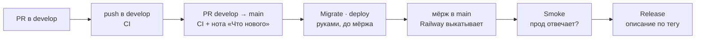

# Actions StudentHub

Шесть прогонов: три запускаются сами (CI, Smoke, Release), три — руками. У каждого в начале файла блок
«СХЕМА ПРОГОНА», а у большинства та же схема попадает в сводку запуска (вкладка **Summary**
открытого прогона) — читать YAML, чтобы понять, что происходит, не нужно.

| Прогон       | Файл           | Когда запускается                              | Что делает                                                          |
| ------------ | -------------- | ---------------------------------------------- | ------------------------------------------------------------------- |
| **CI**       | `ci.yml`       | push в `develop` и `main`, PR в `main`         | линт, типы, тесты, сборка, образы, аудит зависимостей и секретов    |
| **Smoke**    | `smoke.yml`    | push в `main` (то есть после выкатки) и руками | стучится в прод: `/api/v1/health` и главная страница веба           |
| **Migrate**  | `migrate.yml`  | руками                                         | миграции прод-БД: сначала `status` и SQL глазами, потом `deploy`    |
| **SEED**     | `seed.yml`     | руками                                         | доливает данные в прод-БД под меткой; той же меткой убирает налитое |
| **Reset DB** | `reset-db.yml` | руками                                         | очищает прод-БД до одного администратора. Необратимо                |
| **Release**  | `release.yml`  | публикация релиза в GitHub                     | проверяет ноту «Что нового» и заполняет описание релиза             |

## Путь изменения до прода

Миграции применяются **до** мёржа в `main`: Railway деплоит по push в `main`, и новый код
не должен встретить старую схему. Отката у `prisma migrate` нет — порядок в `docs/RELEASE.md`.

## Зачем прогоны знают о проде

`Migrate`, `SEED` и `Reset DB` ходят в боевую базу с раннера, а не с ноутбука: у Railway
закрыт прямой доступ к Postgres из части сетей, а у GitHub-раннера egress открыт. Строка
подключения лежит в секрете `DATABASE_PUBLIC_URL` окружения `production`.
